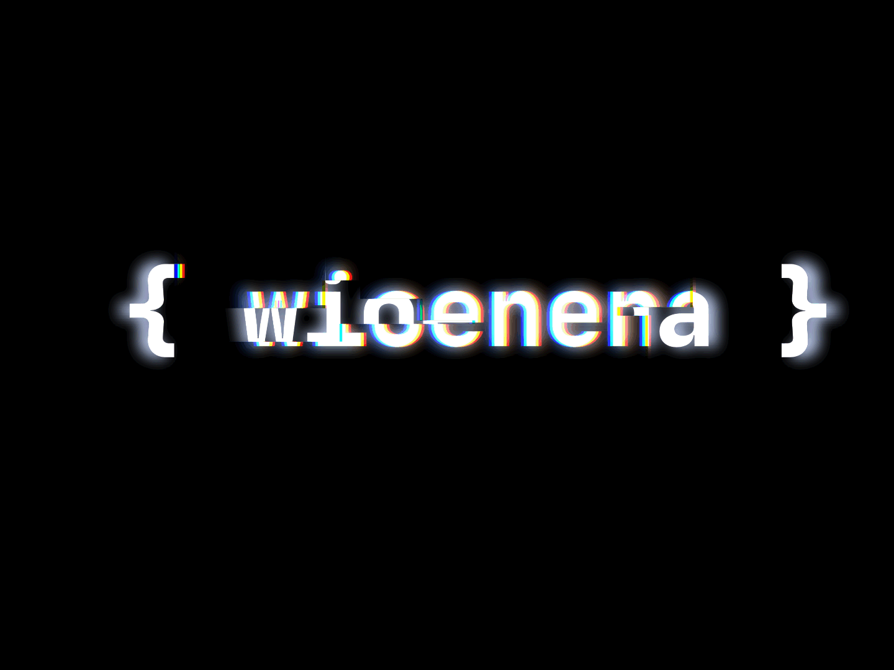

<h1 align="center">
    
</h1>

## 🔧 Technologies & Tools
- 
- 
- 
- 
- 
- 
- 
- 

## &#x1f4c8; GitHub Stats

## 🏆 GitHub Trophies

## 🗂️ Highlight Projects

# contact
- [Instagram](https://instagram.com/wioenena.q)
- [Twitter](https://twitter.com/wioenena)
- [Discord](https://discord.gg/BwyEkW4Qax)